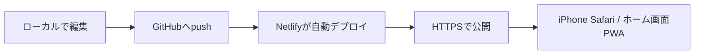

# きろく

「きろく」は、読書・勉強・制作・レッスンなどの日々の活動を、自由な項目で記録できる個人向けPWAです。iPhone Safariでの利用を前提に、端末内保存、ホーム画面追加、オフライン起動、PDF出力に対応しています。

## 1. 修正後のフォルダ構成

```txt
.
├─ assets
│  ├─ apple-touch-icon.png
│  ├─ icon-192.png
│  ├─ icon-512.png
│  └─ icon.svg
├─ vendor
│  └─ tesseract
│     ├─ core
│     │  ├─ tesseract-core-lstm.wasm.js
│     │  ├─ tesseract-core-relaxedsimd-lstm.wasm.js
│     │  └─ tesseract-core-simd-lstm.wasm.js
│     ├─ tesseract.min.js
│     ├─ worker.min.js
│     └─ LICENSE-*
├─ index.html
├─ manifest.webmanifest
├─ netlify.toml
├─ README.md
├─ sw.js
└─ src
   ├─ app.js
   ├─ db.js
   ├─ import-parser.js
   ├─ ocr.js
   └─ styles.css
```

`server.js` は削除しました。Netlifyでは `index.html` を起点に、静的ファイルだけで公開できます。

## 2. IndexedDB設計

保存先は `localStorage` から IndexedDB に変更しました。

- DB名: `kiroku-db`
- バージョン: `1`
- 状態ストア: `state`
- 画像・添付拡張用ストア: `assets`
- 将来のバックアップ拡張用ストア: `backups`

現在のアプリ状態は `state` ストアの `key = "app"` に保存します。OCRで「元画像も保存する」を選んだ場合は、画像Blobを `assets` ストアへ分離し、記録側には `assetIds` だけを保持します。

## 3. localStorageからIndexedDBへの移行

[src/db.js](src/db.js) が保存層です。

初回起動時の流れ:

1. IndexedDBの `state/app` を読む。
2. IndexedDBにデータがあれば、それを正式データとして使う。
3. IndexedDBが空で、旧 `localStorage` の `kiroku.local.v1` があれば自動移行する。
4. 移行後、旧 `localStorage` は削除せず、バックアップとして残す。
5. 移行済みの印として `kiroku.local.v1.indexeddbMigratedAt` を保存する。

保存処理は `async/await` 前提です。通常更新は `window.KirokuDB.saveState()`、OCRの一括追加と任意画像保存は `saveStateAndAssets()` を使用します。

## 4. Netlify公開時の注意点

このアプリはビルド不要です。

- Build command: 空欄
- Publish directory: `.`
- Nodeサーバー: 不要
- HTTPS: Netlify標準の `netlify.app` ドメインで有効

IndexedDBはブラウザ内の保存領域です。Netlifyへ公開しても、記録データがサーバーへ送信されることはありません。同じURLを同じ端末・同じブラウザで開く限り、保存内容は端末内に維持されます。

## 5. netlify.toml

[netlify.toml](netlify.toml) は必要です。理由は、PWA更新時に `sw.js` や `index.html` が古く残りすぎないようにするためです。

設定内容:

- `publish = "."`
- `sw.js` は `no-cache, no-store, must-revalidate`
- `index.html`、`manifest.webmanifest`、`src/*` は再検証
- `assets/*`、`vendor/*` は長期キャッシュ
- 直URLアクセス用に `/*` を `/index.html` へフォールバック

## 6. PWA公開時の注意点

- iPhone SafariではHTTPS公開URLを開き、共有メニューから「ホーム画面に追加」を選びます。
- `sw.js` はアプリ本体をキャッシュし、オフライン時は `index.html` にフォールバックします。
- キャッシュ名は `kiroku-pwa-v5-ocr` です。更新時は新しいキャッシュを作り、古いキャッシュを削除します。
- IndexedDBはService Workerのキャッシュとは別領域なので、アプリ更新で記録データは消えません。
- Safariのプライベートブラウズでは保存領域が制限される場合があります。

## 7. ローカルOCR「画像から記録」

処理の流れ:

1. 「画像から記録」でカメラ撮影または写真選択を行う。
2. [src/ocr.js](src/ocr.js) が長辺2,200px以下へ縮小し、Tesseract.jsのWorkerで端末内OCRを実行する。
3. [src/import-parser.js](src/import-parser.js) がテキスト分割、日付、金額、タイトル候補を抽出する。
4. 全文と生成予定の記録を編集・選択してから、一括保存する。
5. [src/db.js](src/db.js) がアプリ状態と任意の元画像を1つのIndexedDBトランザクションで保存する。

プライバシーと通信:

- 選択画像、OCR結果、記録データは外部サーバーへ送信しません。
- Tesseract.js本体、Worker、WASM Coreは `vendor/tesseract` から同一オリジン配信します。
- 初回OCR時のみ、公式推奨の `https://tessdata.projectnaptha.com/4.0.0` から日本語・英語モデルを取得します。
- 取得済みモデルはTesseract.jsのIndexedDBキャッシュとService Workerキャッシュで再利用します。初回モデル取得前の完全オフライン環境ではOCRを開始できません。
- 「元画像も保存する」は初期値オフです。オンにした場合だけBlobを `assets` ストアへ保存します。

iPhone Safariでの注意:

- 文字が正面から大きく写り、影や傾きが少ない写真ほど認識しやすくなります。
- 15MBを超える画像は受け付けません。OCR用画像は端末メモリを守るため縮小します。
- 初回モデル取得と初期化には時間がかかる場合があります。画面を閉じず、進捗表示を確認してください。
- iOSがストレージを整理する可能性に備え、重要な記録はPDF出力も併用してください。

第三者ライセンス:

- Tesseract.js 7.0.0: [vendor/tesseract/LICENSE-tesseract.js.md](vendor/tesseract/LICENSE-tesseract.js.md)
- Tesseract.js Core 7.0.0: [vendor/tesseract/LICENSE-tesseract.js-core.txt](vendor/tesseract/LICENSE-tesseract.js-core.txt)

## 8. 実装コードの段階

1. `src/db.js` を追加し、IndexedDBのオープン、読み込み、保存、移行関数を実装。
2. `index.html` で `db.js` を `app.js` より先に読み込む。
3. `src/app.js` の `Store` を非同期化し、保存先を `KirokuDB` に変更。
4. 記録作成・編集・削除・設定変更の保存処理を `await` するよう調整。
5. `sw.js` のキャッシュ名を更新し、`src/db.js` をキャッシュ対象に追加。
6. `server.js` を削除し、`netlify.toml` を追加。

## 9. Netlify公開手順

1. このフォルダをGitHubリポジトリへ push します。
2. Netlifyで「Add new project」からGitHubリポジトリを選びます。
3. Build command は空欄にします。
4. Publish directory は `.` にします。
5. Deployします。
6. 発行された `https://...netlify.app/` をiPhone Safariで開きます。
7. 共有メニューから「ホーム画面に追加」を選びます。

## 10. GitHubからNetlifyへの自動更新フロー



運用の目安:

- `main` ブランチを本番公開用にします。
- GitHubへpushするとNetlifyが自動で新しい静的ファイルを公開します。
- アプリ更新後も、記録データは各端末のIndexedDBに残ります。
- 保存構造を変える場合は `src/db.js` の `DB_VERSION` を上げて `onupgradeneeded` に移行処理を追加します。

## 今後の拡張案

- JSONバックアップ / 復元機能。
- 保存済みOCR元画像の閲覧・削除UI。
- 検索、絞り込み、並び替え。
- PDFテンプレート選択。
- パスコードロック。
- iCloudバックアップ対象にしやすいネイティブアプリ化。
